# AIPerf Architecture Diagram

```mermaid
%%{init: {'theme':'dark', 'themeVariables': {'fontSize':'18px', 'fontFamily':'Arial', 'primaryColor':'#2c3e50', 'primaryTextColor':'#ffffff', 'primaryBorderColor':'#5d8aa8', 'lineColor':'#5d8aa8', 'textColor':'#ffffff', 'mainBkg':'#1a1a2e', 'secondBkg':'#16213e', 'clusterBkg':'#141e2e', 'clusterBorder':'#5d8aa8', 'edgeLabelBackground':'#1a1a2e'}}}%%

graph LR
    User["<b>USER</b><br/><br/>CLI Interface"]
    Controller["<b>SYSTEM<br/>CONTROLLER</b><br/><br/>Service Orchestration"]

    Dataset["<b>DATASET<br/>MANAGER</b><br/><br/>Data Source"]
    Timing["<b>TIMING<br/>MANAGER</b><br/><br/>Load Control"]

    Workers["<b>WORKER<br/>POOL</b><br/><br/>Request Execution"]
    Server["<b>INFERENCE<br/>SERVER</b><br/><br/>Target API"]

    Processors["<b>RECORD<br/>PROCESSORS</b><br/><br/>Result Processing"]
    RecordsMgr["<b>RECORDS<br/>MANAGER</b><br/><br/>Metrics Aggregation"]

    GPU["<b>GPU<br/>TELEMETRY</b><br/><br/>DCGM Monitor"]
    Output["<b>RESULTS</b><br/><br/>Output Files"]

    User ==>|Initialize| Controller
    Controller ==>|Create Services| Dataset
    Controller ==>|Create Services| Timing
    Dataset -->|Data Feed| Workers
    Timing ==>|Rate Limiting| Workers
    Workers <==>|Request/Response| Server
    Workers ==>|Raw Response Data| Processors
    Processors ==>|Per-Request Metrics| RecordsMgr
    GPU -.->|Telemetry Data| RecordsMgr
    RecordsMgr ==>|Aggregated Metrics| Output

    style User fill:#4a6278,stroke:#6b8ba8,stroke-width:4px,color:#ffffff
    style Controller fill:#3d5a80,stroke:#5d7aa8,stroke-width:4px,color:#ffffff
    style Dataset fill:#4a6f8a,stroke:#6a8faa,stroke-width:4px,color:#ffffff
    style Timing fill:#4a6f8a,stroke:#6a8faa,stroke-width:4px,color:#ffffff
    style Workers fill:#547aa3,stroke:#749aba,stroke-width:4px,color:#ffffff
    style Server fill:#6b8ca8,stroke:#8bacb8,stroke-width:4px,color:#ffffff
    style Processors fill:#5a7b9a,stroke:#7a9bba,stroke-width:4px,color:#ffffff
    style RecordsMgr fill:#4d6b88,stroke:#6d8ba8,stroke-width:4px,color:#ffffff
    style GPU fill:#5a8098,stroke:#7aa0b8,stroke-width:4px,color:#ffffff
    style Output fill:#536b82,stroke:#738ba2,stroke-width:4px,color:#ffffff

    linkStyle 0 stroke:#6b8ba8,stroke-width:4px
    linkStyle 1 stroke:#6a8faa,stroke-width:4px
    linkStyle 2 stroke:#6a8faa,stroke-width:4px
    linkStyle 3 stroke:#5d8aa8,stroke-width:3px
    linkStyle 4 stroke:#6a8faa,stroke-width:4px
    linkStyle 5 stroke:#8bacb8,stroke-width:4px
    linkStyle 6 stroke:#7a9bba,stroke-width:4px
    linkStyle 7 stroke:#6d8ba8,stroke-width:4px
    linkStyle 8 stroke:#7aa0b8,stroke-width:3px,stroke-dasharray:5
    linkStyle 9 stroke:#738ba2,stroke-width:4px
```

## Architecture Flow

1. **USER** initiates benchmark via CLI with configuration parameters
2. **SYSTEM CONTROLLER** instantiates **DATASET MANAGER** service for data provisioning
3. **SYSTEM CONTROLLER** instantiates **TIMING MANAGER** service for load control
4. **TIMING MANAGER** regulates **WORKER POOL** concurrency and request rate limits
5. **WORKERS** retrieve conversation data from **DATASET MANAGER** on-demand
6. **DATASET MANAGER** provides tokenized conversation payloads to **WORKERS**
7. **WORKERS** execute HTTP/HTTPS requests to **INFERENCE SERVER** endpoint
8. **INFERENCE SERVER** returns streaming or batch responses to **WORKERS**
9. **WORKERS** forward raw response data to **RECORD PROCESSORS** for parallel processing
10. **RECORD PROCESSORS** parse responses and compute per-request metrics (TTFT, ITL, throughput)
11. **RECORD PROCESSORS** transmit structured metrics to **RECORDS MANAGER**
12. **GPU TELEMETRY** continuously monitors GPU resources via DCGM and feeds telemetry to **RECORDS MANAGER**
13. **RECORDS MANAGER** aggregates all metrics and exports to **RESULTS** layer (CSV, JSON, Dashboard)

## Core Components

- **SYSTEM CONTROLLER**: Orchestrates all services, manages lifecycle
- **DATASET MANAGER**: Loads/generates input prompts and conversations
- **TIMING MANAGER**: Controls worker concurrency and request rate
- **WORKER POOL**: Multiple processes sending concurrent HTTP requests
- **INFERENCE SERVER**: Target LLM API being benchmarked
- **RECORD PROCESSORS**: Parse responses in parallel, compute per-request metrics
- **RECORDS MANAGER**: Aggregates metrics, tracks progress, computes statistics
- **GPU TELEMETRY**: Monitors GPU utilization, power, memory via DCGM
- **RESULTS**: Exports to CSV/JSON files and real-time TUI dashboard

## Key Architecture Details

- **Request timing control**: Timing Manager controls worker concurrency and request rate
- **Parallel processing**: Multiple Record Processors parse results concurrently
- **ZMQ messaging**: All components communicate via ZeroMQ message bus (not shown for simplicity)
- **Async execution**: Workers use async HTTP with connection pooling
- **Streaming support**: Workers handle Server-Sent Events (SSE) for streaming responses
