<!--
SPDX-FileCopyrightText: Copyright (c) 2024-2025 NVIDIA CORPORATION & AFFILIATES. All rights reserved.
SPDX-License-Identifier: Apache-2.0
-->

# Visualization and Plotting with AIPerf

Generate PNG visualizations from AIPerf profiling data with automatic mode detection (single-run analysis or multi-run comparison), NVIDIA brand styling, and support for multi-run comparisons and single-run analysis.

## Overview

The `aiperf plot` command generates static PNG visualizations from your profiling results. It automatically detects whether to show multi-run comparison plots or single-run time series analysis based on your directory structure, making it easy to visualize performance trends without manual configuration.

**Key Features:**
- **Automatic mode detection**: Compares multiple runs or analyzes single runs based on directory structure
- **GPU telemetry integration**: Visualize power, utilization, memory, and temperature metrics
- **Timeslice support**: View performance evolution across time windows

## Quick Start

```bash
# Analyze a single profiling run (outputs to <single_run_name>/plot_export/)
aiperf plot <single_run_name>

# Compare multiple runs in a directory (outputs to <run_directory>/plot_export/)
aiperf plot <run_directory>

# Compare all runs in multiple directories (outputs to <run_directory>/plot_export/)
aiperf plot <run_directory1> <run_directory2> ... <run_directoryn>

# Compare multiple specific runs (outputs to <single_run_name1>/plot_export/)
aiperf plot <single_run_name1> <single_run_name2> ... <single_run_namen>

# Specify custom output location
aiperf plot <path> --output <output_directory>

# Use dark theme for presentations
aiperf plot <path> --theme dark
```

The command automatically detects visualization mode:
- **Multi-run comparison**: When directory contains multiple run subdirectories
- **Single-run analysis**: When directory contains `profile_export.jsonl` directly

## Visualization Modes

The plot command automatically detects the visualization mode based on directory structure:

### Multi-Run Comparison Mode

**Detected when:**
- Directory contains multiple run subdirectories
- Multiple paths are specified as arguments

**Example directory structures:**
```
artifacts/sweep_qwen/          # Contains multiple runs
├── Qwen3-0.6B-concurrency1/
├── Qwen3-0.6B-concurrency2/
└── Qwen3-0.6B-concurrency4/
```

**Generated plots (3 default):**
2. **TTFT vs Throughput** - Time to first token vs request throughput across concurrency levels
4. **Token Throughput per GPU vs Latency** - GPU efficiency vs latency (when GPU telemetry available)
5. **Token Throughput per GPU vs Interactivity** - GPU efficiency vs TTFT (when GPU telemetry available)

#### Example Multi-Run Visualizations

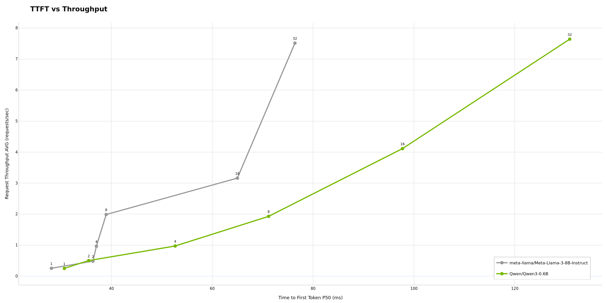

The TTFT vs Throughput plot shows how time to first token varies with request throughput across different concurrency levels, helping identify configurations that balance responsiveness with system load.

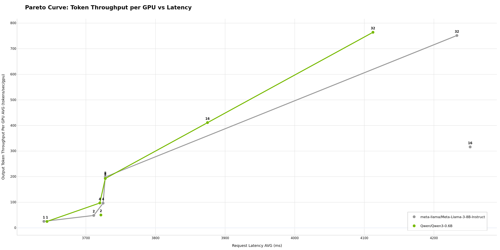

The Pareto curve highlights optimal configurations that maximize GPU efficiency while minimizing latency. Points on the Pareto frontier represent the best trade-offs between these metrics.

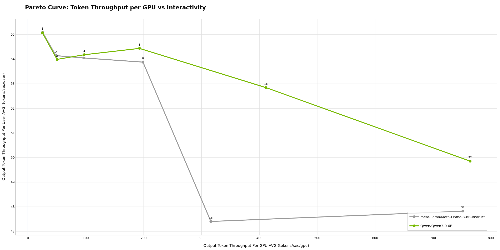

This Pareto curve shows the trade-off between GPU efficiency (tokens/sec/GPU) and interactivity (TTFT), helping identify configurations that maximize GPU utilization while maintaining acceptable first-token latency.

### Single-Run Analysis Mode

**Detected when:**
- Directory contains `profile_export.jsonl` directly
- Path points to a single profiling run

**Example directory structure:**
```
artifacts/single_run/          # Single run directory
└── profile_export.jsonl
```

**Generated plots (4+ default):**
1. **TTFT Over Time** - Scatter plot of time to first token for each request
2. **Inter-Token Latency Over Time** - Scatter plot of ITL for each request
3. **Request Latency Over Time** - Area chart showing end-to-end latency progression
4. **Dispersed Throughput Over Time** - Event-based throughput showing continuous token generation rate

**Additional plots (when data available):**
- **Timeslice plots**: TTFT, ITL, throughput, and latency metrics across time windows (when `--slice-duration` was used)
- **GPU telemetry plots**: GPU utilization and memory usage over time (when `--gpu-telemetry` was used)

#### Example Single-Run Time Series Visualizations

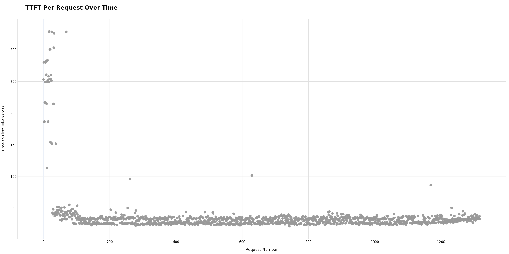

The TTFT Over Time scatter plot shows the time to first token for each request throughout the benchmark run, helping identify patterns in prefill latency and potential warm-up or degradation effects.

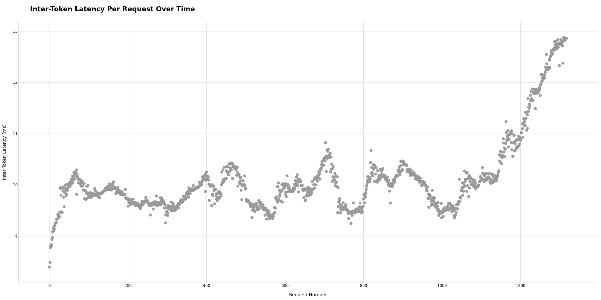

The ITL Over Time scatter plot displays inter-token latency for each request, revealing generation performance consistency and identifying outliers or performance variations over the run duration.

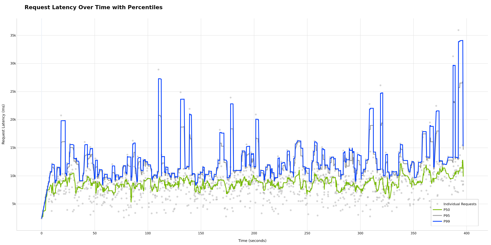

The Request Latency Over Time area chart shows end-to-end latency progression throughout the run, providing a holistic view of system performance including both prefill and generation phases.

### Dispersed Throughput Over Time

The **Dispersed Throughput Over Time** plot uses an event-based approach to accurately represent token generation rates. Unlike traditional binning methods that create artificial spikes when requests complete, this visualization distributes tokens evenly across the time they were actually generated.

**How it works:**
- **Prefill phase** (`request_start` → `TTFT`): No output tokens (0 tok/sec)
- **Generation phase** (`TTFT` → `request_end`): Constant token rate = `output_tokens / (request_end - TTFT)`
- Plot shows sum of all concurrent token generation rates
- Throughput changes only at discrete events (request starts generating or completes)

**Why dispersed vs binning?**

Traditional binning creates artificial spikes, requires arbitrary bin size selection, and misses patterns between bins. Dispersed throughput provides smooth, continuous representation that accurately correlates with server metrics like GPU utilization.


## Command Options

### Basic Options

```bash
# Analyze a single profiling run (outputs to <single_run_name>/plot_export/)
aiperf plot <single_run_name>

# Compare multiple runs in a directory (outputs to <run_directory>/plot_export/)
aiperf plot <run_directory>

# Compare all runs in multiple directories (outputs to <run_directory>/plot_export/)
aiperf plot <run_directory1> <run_directory2> ... <run_directoryn>

# Compare multiple specific runs (outputs to <single_run_name1>/plot_export/)
aiperf plot <single_run_name1> <single_run_name2> ... <single_run_namen>

# Specify custom output location
aiperf plot <path> --output <output_directory>

# Use dark theme for presentations
aiperf plot <path> --theme dark
```

### Output Directory Logic

The output directory follows this logic:
1. If `--output` is specified, use that path
2. Otherwise, use `<first_input_path>/plot_export/`
3. Default first input path is `./artifacts` if no paths specified

**Examples:**
```bash
# Outputs to: ./artifacts/plot_export/
aiperf plot

# Outputs to: <sweep_directory>/plot_export/
aiperf plot <sweep_directory>

# Outputs to: <custom_output_path>
aiperf plot <sweep_directory> --output <custom_output_path>
```

## Theme Options

Choose between light and dark themes for your plots:

```bash
# Light theme (default)
aiperf plot <path>

aiperf plot <path> --theme light

# Dark theme
aiperf plot <path> --theme dark
```

### Dark Theme Examples

The dark theme uses a dark background optimized for presentations and low-light environments while maintaining NVIDIA brand colors and readability.

#### Multi-Run Dark Theme

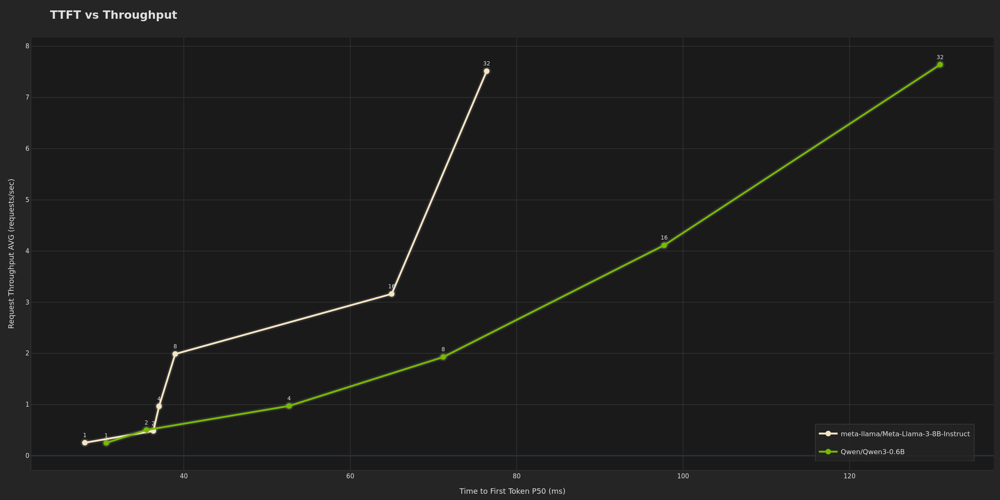

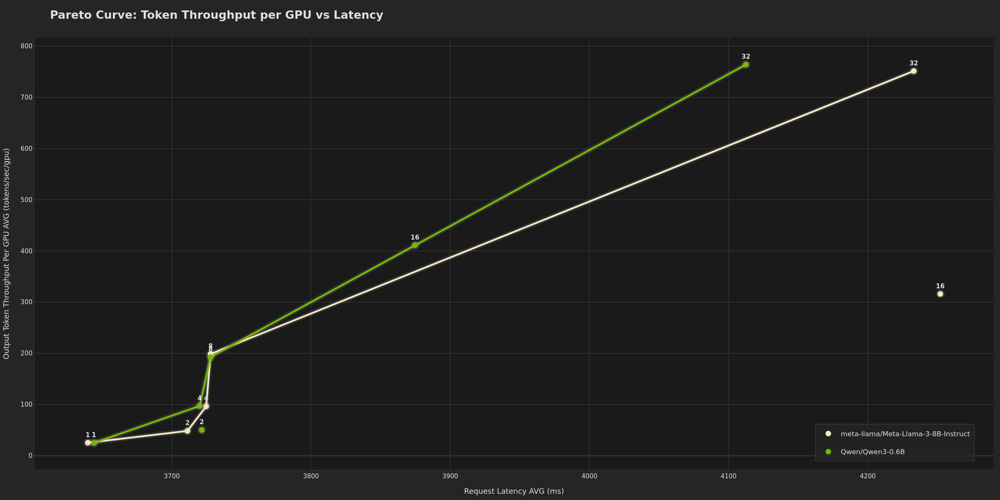


#### Single-Run Dark Theme


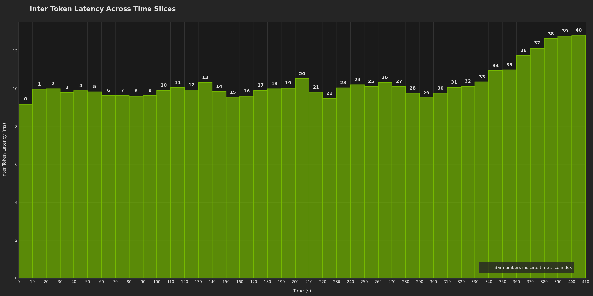

## GPU Telemetry Integration

When GPU telemetry is collected during profiling (via `--gpu-telemetry` flag), the plot command automatically includes GPU metrics in visualizations.

**Multi-run plots** (when telemetry available across runs):
- Token Throughput per GPU vs Latency
- Token Throughput per GPU vs Interactivity (TTFT)

**Single-run plots** (time series with telemetry):
- GPU Utilization Over Time
- GPU Memory Usage Over Time

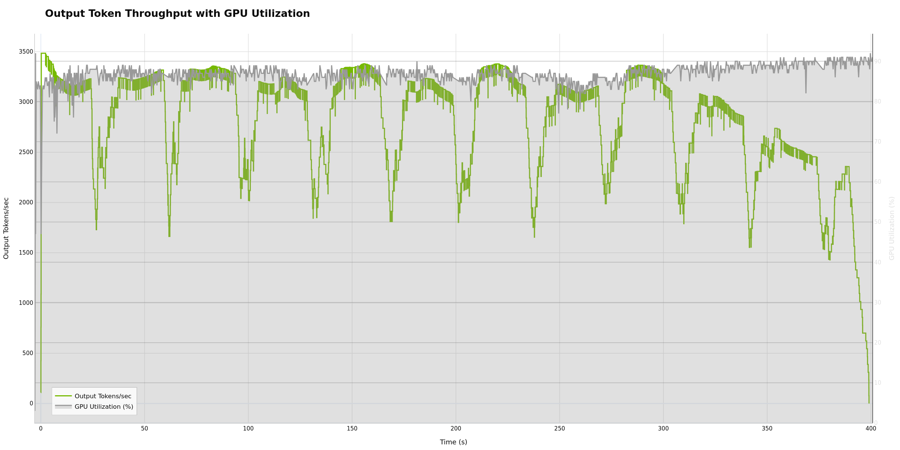

> [!TIP]
> For GPU telemetry setup and detailed analysis, see the [GPU Telemetry Tutorial](gpu-telemetry.md).

## Timeslice Integration

When timeslice data is available (via `--slice-duration` during profiling), the plot command automatically generates timeslice visualizations showing performance evolution across time windows.

**Generated timeslice plots:**
- TTFT Across Timeslices
- ITL Across Timeslices
- Throughput Across Timeslices
- Latency Across Timeslices

These help identify warm-up effects, performance degradation, and steady-state behavior.

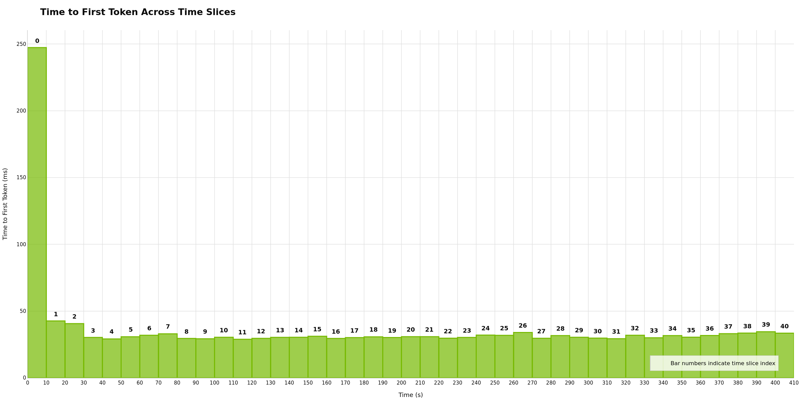

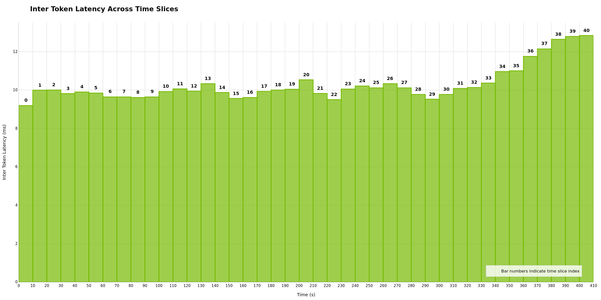


> [!NOTE]
> **Throughput Warning**: The throughput plot displays a warning when requests have varying input/output sequence lengths. In these cases, requests per second may not accurately represent workload capacity. Consider using token throughput metrics for non-uniform workloads.


> [!TIP]
> For detailed timeslice configuration and analysis, see the [Timeslices Tutorial](timeslices.md).


## Output Files

The plot command generates the following files in the output directory:

```
plot_export/
├── pareto_curve_latency_vs_throughput.png
├── ttft_vs_throughput.png
├── output_token_throughput_per_user_vs_concurrency.png
├── dispersed_throughput_over_time.png (for single-run analysis)
├── token_throughput_per_gpu_vs_latency.png (if GPU telemetry available)
├── token_throughput_per_gpu_vs_ttft.png (if GPU telemetry available)
└── ... (additional plots based on mode and available data)
```


## Best Practices

> [!TIP]
> **Consistent Configurations**: When comparing runs, keep all parameters identical except the one you're testing (e.g., only vary concurrency). This ensures plots show the impact of that specific parameter.
> Future features in interactive mode will allow pop-ups to show specific configurations of plotted runs.

> [!TIP]
> **Include Warmup**: Use `--warmup-request-count` to ensure the server reaches steady state before measurement. This reduces noise in your visualizations.

> [!WARNING]
> **Directory Structure**: The plot command relies on consistent directory naming. Ensure all runs you want to compare are in subdirectories of a common parent directory.

> [!NOTE]
> **GPU Metrics**: GPU telemetry plots only appear when telemetry data is available. Make sure DCGM is running and accessible during profiling. See [GPU Telemetry Tutorial](gpu-telemetry.md).

## Troubleshooting

### No Plots Generated

**Problem**: Running `aiperf plot` but no PNG files appear.

**Solutions**:
- Verify the input directory contains valid profiling data (`profile_export.jsonl` files)
- Check that the output directory is writable
- Look for error messages in the console output

### Missing GPU Plots

**Problem**: Expected GPU telemetry plots but they don't appear.

**Solutions**:
- Verify GPU telemetry was collected during profiling (check `gpu_telemetry_export.jsonl` for telemetry data)
- Ensure DCGM exporter was running and accessible during profiling
- Confirm telemetry data is present in the profile exports

### Incorrect Mode Detection

**Problem**: Multi-run data showing single-run plots or vice versa.

**Solutions**:
- Check directory structure matches expected format:
  - Multi-run: parent directory with multiple run subdirectories
  - Single-run: directory with `profile_export.jsonl` directly inside
- Ensure all run directories contain valid `profile_export.jsonl` files

## Related Documentation

- [Working with Profile Exports](working-with-profile-exports.md) - Understanding profiling data format
- [GPU Telemetry](gpu-telemetry.md) - Collecting GPU metrics during profiling
- [Timeslices](timeslices.md) - Time-windowed performance analysis
- [Request Rate and Concurrency](request-rate-concurrency.md) - Load generation strategies for sweeps
